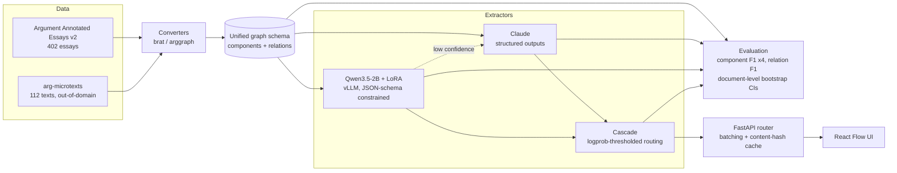

# Argument Mapper

**Can a fine-tuned 2B open model replace a frontier API for structured argument
extraction, and at what cost?**

Argument extraction is a structured-output task: given an argumentative text,
identify its claims and premises as spans, and the support/attack relations
between them. Frontier APIs do it well. This repository measures what it costs
to stop paying for them — F1, dollars, and latency, with confidence intervals,
on a standard benchmark and an out-of-domain test set.

Every number below is produced by a script in this repository and written under
`results/`. Anything not yet measured says `TBD` rather than an estimate.

---

## Status

| Milestone | State |
|---|---|
| 1. Data and metrics | ✅ complete |
| 2. Frontier baselines (Sonnet 5, Haiku 4.5) | ⬜ |
| 3. LoRA fine-tune (Qwen3.5-2B) | ⬜ |
| 4. Constrained decoding (vLLM JSON schema) | ⬜ |
| 5. Cascade routing | ⬜ |
| 6. Serving and load test | ⬜ |
| 7. UI | ⬜ |
| 8. DeBERTa-v3 baseline (stretch) | ⬜ |

---

## Architecture



---

## Results

### Datasets

Measured by `argmap-build-datasets`, written to
[`results/datasets/summary.json`](results/datasets/summary.json).

| | AAE v2 | arg-microtexts (en) |
|---|---|---|
| Documents | 402 (258 train / 64 val / 80 test) | 112 (all test) |
| Mean length | 1,974 chars | 423 chars |
| Components | 6,089 | 576 |
| — MajorClaim / Claim / Premise | 751 / 1,506 / 3,832 | not labelled |
| Relations | 3,832 | 464 |
| — supports / attacks | 3,613 / 219 | 290 / 174 |
| Stance (For / Against) | 1,228 / 278 | n/a |

Two properties of this data shape every result that follows:

- **`attacks` is 5.7% of AAE relations** (219 of 3,832), leaving roughly 44 in
  the test set. Per-type attack F1 therefore carries a very wide interval, and
  untyped micro-F1 is the headline number.
- **arg-microtexts has no component type labels.** Its ADUs carry `pro`/`opp`
  dialectical roles, not the MajorClaim/Claim/Premise typology, so typed
  component F1 is reported as N/A there rather than as a fabricated number.

### Alignment ceiling

A model that emits component *text* has not said where that text is. Aligning
it back to a span introduces error that is charged to the extractor, so it caps
achievable F1. Measured by aligning **gold** component text against **gold**
documents, where the right answer is known:

`TBD` — see `results/alignment/alignment_error.json`

### Extraction quality

`TBD` — milestone 2.

### Cost and latency

`TBD` — milestone 2.

### Cascade operating points

`TBD` — milestone 5.

### Throughput

`TBD` — milestone 6.

---

## Reproducing

Requires Python 3.11+ and [uv](https://docs.astral.sh/uv/).

```bash
uv sync --extra dev
```

### Data

`arg-microtexts` downloads automatically. **Argument Annotated Essays v2 cannot
be downloaded headlessly** — TUdatalib sits behind a proof-of-work bot
challenge that returns an HTML page to any non-browser client. Fetch it once in
a browser:

1. Open <https://tudatalib.ulb.tu-darmstadt.de/handle/tudatalib/2422>
2. Clear the bot challenge and download `ArgumentAnnotatedEssays-2.0.zip`
3. Place it in `data/raw/`

It is verified by SHA-256 on load. Then:

```bash
uv run argmap-build-datasets            # -> data/processed/, splits/, results/datasets/
uv run python -m argmap.cli.eval_alignment
```

### Checks

```bash
uv run ruff check . && uv run ruff format --check .
uv run pyright
uv run pytest
```

CI runs all three on CPU against synthetic fixtures, so it never needs the
licensed corpora.

---

## Licensing and data handling

**The corpora are not in this repository and must not be added to it.**

Argument Annotated Essays v2 is distributed under a TU Darmstadt / UKP
agreement restricting it to academic use, whose clause 2.2 forbids publishing,
redistributing, or displaying the data in any form. This repository is public,
so:

- `data/` is gitignored, and a CI job fails the build if corpus files are ever
  tracked
- few-shot exemplars are generated into a gitignored file at runtime rather
  than hardcoded into committed source
- fine-tuned weights are not published, being plausibly derivative
- screenshots use a synthetic passage, never corpus text

If you use the corpora, cite them:

- Christian Stab and Iryna Gurevych. 2016. *Parsing Argumentation Structure in
  Persuasive Essays.* <https://arxiv.org/abs/1604.07370>
- Andreas Peldszus and Manfred Stede. 2015. *An annotated corpus of
  argumentative microtexts.* First European Conference on Argumentation.
  (CC BY-NC-SA 4.0)

The code in this repository is MIT licensed.

---

## Layout

```
src/argmap/
  schema.py        unified graph schema; validates span/text integrity
  align.py         fuzzy text -> span alignment, and its refinement pass
  data/            corpus converters (brat, arggraph), download, splits
  metrics/         matching criteria, P/R/F1, document-level bootstrap
  cli/             dataset build, alignment study
tests/             pytest; synthetic fixtures only, no corpus needed
web/               React Flow + dagre front end
results/           every measured number
splits/            essay ID lists (no text) so splits are reproducible
```
