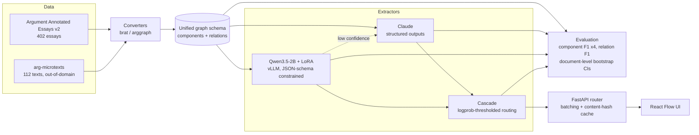
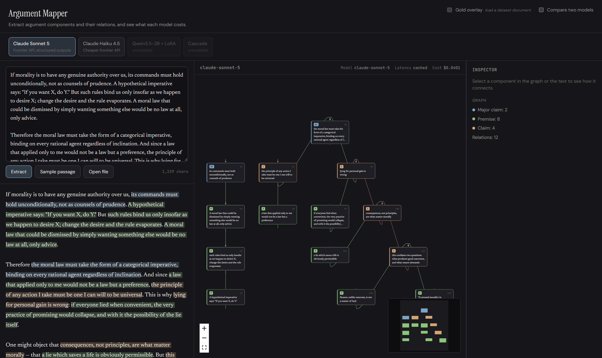
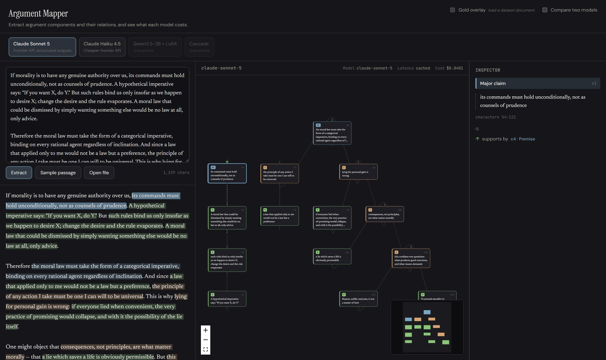

# Argument Mapper

**Can a fine-tuned 2B open model replace a frontier API for structured argument
extraction, and at what cost?**

Argument extraction is a structured-output task: given an argumentative text,
identify its claims and premises as spans, and the support/attack relations
between them. Frontier APIs do it well. This repository measures what it costs
to stop paying for them — F1, dollars, and latency, with confidence intervals,
on a standard benchmark and an out-of-domain test set.

Every number below is produced by a script in this repository and written under
`results/`. Anything not yet measured says `TBD` rather than an estimate.

---

## Status

| Milestone | State |
|---|---|
| 1. Data and metrics | ✅ complete |
| 2. Frontier baselines (Sonnet 5, Haiku 4.5) | ✅ complete |
| 3. LoRA fine-tune (Qwen3.5-2B) | ✅ complete |
| 4. Constrained decoding (vLLM JSON schema) | ✅ complete |
| 5. Cascade routing | ✅ complete |
| 6. Serving and load test | ✅ complete |
| 7. UI | ✅ complete |
| 8. DeBERTa-v3 baseline (stretch) | — not attempted |

---

## Architecture



---

## Results

### Datasets

Measured by `argmap-build-datasets`, written to
[`results/datasets/summary.json`](results/datasets/summary.json).

| | AAE v2 | arg-microtexts (en) |
|---|---|---|
| Documents | 402 (258 train / 64 val / 80 test) | 112 (all test) |
| Mean length | 1,974 chars | 423 chars |
| Components | 6,089 | 576 |
| — MajorClaim / Claim / Premise | 751 / 1,506 / 3,832 | not labelled |
| Relations | 3,832 | 464 |
| — supports / attacks | 3,613 / 219 | 290 / 174 |
| Stance (For / Against) | 1,228 / 278 | n/a |

Two properties of this data shape every result that follows:

- **`attacks` is 5.7% of AAE relations** (219 of 3,832), leaving roughly 44 in
  the test set. Per-type attack F1 therefore carries a very wide interval, and
  untyped micro-F1 is the headline number.
- **arg-microtexts has no component type labels.** Its ADUs carry `pro`/`opp`
  dialectical roles, not the MajorClaim/Claim/Premise typology, so typed
  component F1 is reported as N/A there rather than as a fabricated number.

### Alignment ceiling

A model that emits component *text* has not said where that text is. Aligning
it back to a span introduces error that is charged to the extractor, so it caps
achievable F1. Measured by aligning **gold** component text against **gold**
documents, where the right answer is known exactly — 144 AAE documents (val +
test), 2,232 components. Full output in
[`results/alignment/alignment_error.json`](results/alignment/alignment_error.json).

| Condition | Exact span | Exact span (refined) | ≥50% overlap |
|---|---|---|---|
| verbatim | 0.998 | 0.998 | 0.998 |
| whitespace collapsed | 0.998 | 0.998 | 0.998 |
| lowercased | 0.598 | **0.950** | 0.997 |
| reworded (interior tokens dropped) | 0.167 | **0.780** | 0.992 |

Nothing failed to align in any condition (failure rate 0.000 throughout).
arg-microtexts behaves the same or slightly better (reworded: 0.167 → 0.781,
≥50% overlap 1.000).

Three things follow, and they shape how every later result should be read:

1. **Under overlap matching, alignment is not a meaningful ceiling.** Even when
   the text is reworded so that substring search cannot find it, 99.2% of
   components still land within the ≥50% criterion. Overlap-based F1 measures
   extraction, not alignment.
2. **Exact-span F1 largely measures verbatim copying.** It falls from 0.998 to
   0.167 purely from perturbing the text, with no change in extraction quality
   whatsoever. A model that paraphrases correctly is punished as hard as one
   that is wrong. Exact-span numbers are reported for comparability, but
   overlap is the headline.
3. **The refinement pass is worth 4.7×** on paraphrased text (0.167 → 0.780).
   The v1 matcher slides its window in quarter-window steps, so it can only
   land on the true boundary by luck; the hill-climb fixes that.

Two conditions in the JSON — `trimmed` and `truncated_80pct` — are flagged
`exact_span_meaningful: false`. Removing tokens only from the ends leaves a
contiguous substring that `str.find` still locates, so they exercise substring
search rather than alignment, and their true span genuinely differs from the
gold span. They are kept as a degradation check, not read as error.

### Extraction quality

Few-shot (3 exemplars from train), structured outputs, prompt caching.
Intervals are 95% bootstrap over documents. Full reports in
[`results/baselines/`](results/baselines/).

**Argument Annotated Essays, test split (80 documents)**

| Model | Component F1 (overlap, untyped) | Component F1 (overlap, typed) | Relation F1 (overlap) |
|---|---|---|---|
| Claude Haiku 4.5 | 0.859 [0.830, 0.882] | 0.709 [0.673, 0.743] | 0.441 [0.390, 0.494] |
| Claude Sonnet 5 | 0.883 [0.868, 0.897] | **0.762** [0.733, 0.791] | **0.485** [0.428, 0.542] |
| Qwen3.5-2B + LoRA | **0.899** [0.879, 0.917] | 0.756 [0.730, 0.782] | 0.452 [0.395, 0.510] |

**arg-microtexts, out-of-domain (112 documents).** Typed metrics are N/A —
this corpus has no component type labels.

| Model | Component F1 (overlap, untyped) | Relation F1 (overlap) |
|---|---|---|
| Claude Haiku 4.5 | 0.843 [0.810, 0.874] | 0.514 [0.460, 0.567] |
| Claude Sonnet 5 | **0.945** [0.930, 0.960] | **0.676** [0.626, 0.725] |

**Is Sonnet actually better?** Paired bootstrap over the same documents, in
[`results/comparisons/`](results/comparisons/). On AAE test it wins
significantly on 7 of 8 measures — but the headline relation F1 gap is
`+0.044 [-0.001, +0.089]`, which **straddles zero**. Comparing the two
marginal intervals would have missed that; the paired test is what makes the
claim honest.

Three things worth noting:

- **Zero invalid outputs in 550 API calls.** Structured outputs
  (`output_config.format`) made the v1 JSON-repair path entirely unnecessary on
  the Claude route.
- **Only 2 components out of ~7,000 could not be aligned** back to a span, so
  the generate-then-align design costs almost nothing in practice.
- **Relation F1 is the weak half** of both models, at 0.44–0.49 in domain.
  Components are close to solved; relations are not.

### Exact-span F1 is a trap

The alignment ceiling above is not academic. On arg-microtexts, whose spans are
reconstructed from EDUs, exact-span component F1 is **0.025** for Sonnet 5
while overlap F1 on the *same predictions* is **0.945**. The model is finding
the right components and being scored near zero for not reproducing byte
offsets. This is why overlap is the headline metric throughout.

### Cost and latency

API prices are per-document means from the spend ledger
([`results/cost/`](results/cost/)). The local price is the A10G hourly rate
divided by **measured** peak throughput from the load test below — not an
estimate.

| | $/doc | $/1K docs | vs local | p50 latency |
|---|---|---|---|---|
| Qwen3.5-2B + LoRA (A10G) | $0.000085 | **$0.09** | — | **5.3 s** |
| Claude Haiku 4.5 | $0.00398 | $3.98 | 47× | 3.4 s |
| Claude Sonnet 5 | $0.01581 | $15.81 | **186×** | 10.9 s |

The local model is also roughly **half Sonnet's latency** at concurrency 1.
The honest caveat on the cost ratio: it assumes a saturated GPU. An A10G idling
between requests costs the same per hour, so the advantage is real for batch
workloads and shrinks with utilisation.

### Can a fine-tuned 2B replace the API?

**On this task, yes — and the first answer this repository produced was "no",
which is the more useful result.**

A paired bootstrap over the same 80 test documents, all four matching criteria,
components and relations. Full output in
[`results/comparisons/`](results/comparisons/).

| Qwen3.5-2B + LoRA vs | Components | Relations | Significant |
|---|---|---|---|
| Claude Sonnet 5 (overlap, untyped) | +0.016 [−0.003, +0.033] | −0.034 [−0.097, +0.029] | **0 of 8** measures |
| Claude Sonnet 5 (overlap, typed) | −0.006 [−0.036, +0.025] | −0.048 [−0.113, +0.019] | — |
| Claude Haiku 4.5 (overlap, untyped) | **+0.040** [+0.013, +0.072] | +0.010 [−0.053, +0.072] | **4 of 8** measures |
| Claude Haiku 4.5 (overlap, typed) | **+0.048** [+0.013, +0.083] | −0.001 [−0.066, +0.065] | — |

Against Sonnet 5 **none of the eight differences excludes zero**: on this
corpus a 2B model with an adapter touching 0.58% of its parameters is
statistically indistinguishable from the frontier model, at 186× less per
document. Against Haiku 4.5 it wins component extraction on all four criteria
and ties on relations.

This is not a claim that 2B models match frontier models in general. It is a
claim about one narrow, well-specified, in-domain task with 258 training
examples — which is exactly the shape of task worth fine-tuning for, and
exactly the shape of task where an API call is hardest to justify.

#### This result was wrong at first, and the way it was wrong matters

Before the fix, the same model measured 0.518 typed component F1 and 0.049
untyped relation F1 (the pre-fix report is kept verbatim at
[`results/diagnostics/qwen3.5-2b-lora_aae-v2_test_pre-merge-fix.json`](results/diagnostics/)),
and its relation output was a **star**: the first component supporting every
other one. That looked like a clean finding — components
transfer to a small model, structure does not.

It was an artefact. vLLM accepted `--enable-lora`, accepted the `lora_request`
on every call, JIT-compiled the LoRA kernels, and served **base-model weights**.
No error, no warning. Five checks passed while the conclusion stayed false: the
adapter files were real and non-trivial, checkpoints from different epochs
differed on disk, the request was accepted, the kernels compiled, and 3 of 8
documents produced different output between adapters.

The decisive test was smaller than any of them — *ask the model to reproduce
its own training data*. Six documents the adapter saw ten times, generated
three ways
([`scripts/gpu/probe_adapter_effect.py`](scripts/gpu/probe_adapter_effect.py),
output in [`results/diagnostics/`](results/diagnostics/)):

| Path | Valid JSON | What it emitted |
|---|---|---|
| base model, transformers | **0 / 6** | `### MajorClaim` — Markdown, a different shape each time |
| base + adapter, PEFT | **6 / 6** | `{"components":[{"id":"c1","type":"MajorClaim",…` |
| merged weights, transformers | **2 / 2** | identical to PEFT |

The adapter was fine. The serving path was not. Merging the adapter into the
base weights and serving the merged model — which is what a production
deployment would do anyway — inverted every result above.

One signal had been visible the whole time and was misread: checkpoint
selection scored three different random seeds at **0.262997, standard
deviation 0.000000**
([`results/training/checkpoint_selection.json`](results/training/)). Three
independent fine-tunes agreeing to six decimal places is not a stable recipe,
it is the same model three times. Those selection numbers predate the fix and
are kept as the record of it.

Two things make the corrected result trustworthy rather than lucky:

- **Prompt parity was verified independently**
  ([`scripts/gpu/probe_prompt_parity.py`](scripts/gpu/probe_prompt_parity.py)):
  the inference prompt is an exact character prefix of the training text, the
  empty thinking block appears in both, and the tokenised training labels end
  in `<|im_end|>` — so the model was taught where to stop.
- **Checkpoint selection was re-run on merged weights.** Epoch 10 beats epoch 2
  on validation (untyped component F1 0.894 vs 0.888, relation F1 0.455 vs
  0.398), so the 10-epoch checkpoint carried through — selected on validation,
  scored once on test.

### Constrained decoding

Same model, same prompts, same greedy decoding. The only difference is whether
vLLM was given the JSON schema. Measured on AAE test;
[`results/constrained/`](results/constrained/).

| | Invalid output | Truncated | Component F1 (overlap, untyped) |
|---|---|---|---|
| Constrained | **0.0%** (0/80) | 0.0% | 0.899 [0.879, 0.917] |
| Unconstrained | 1.2% (1/80) | 1.2% | 0.890 [0.869, 0.909] |

**Constrained decoding buys a guarantee, not quality.** Seven of the eight
paired differences do not exclude zero; the eighth is +0.009 [+0.001, +0.019]
on untyped overlap components — real, and tiny. A model fine-tuned on this
format emits it unprompted 98.8% of the time.

That 1.2% is still why the local route carries **no JSON-repair path**. One
unparseable document in eighty is one failed request in eighty; the schema
turns a tail risk into an impossibility at no measurable cost in quality. The
Claude route keeps Pydantic validation and has never needed it either — 550
API calls, zero invalid outputs.

**Syntax is not termination.** An earlier unbounded schema produced output that
was well-formed and still unusable: the model emitted the *type name* as each
component id, every relation referenced the same two generic ids, and an
unbounded array of such relations stays schema-valid forever. The grammar never
required a closing bracket, so generation ran to the token cap. The fix is to
make termination a property of the grammar — `maxItems` — and to check the
bound is reachable *within* the token budget, which a regression test now does.
This was observed while the serving path was silently running base weights, so
it describes an unadapted model. That is precisely the case constrained
decoding exists for, and the mechanism does not depend on the model.

### Cascade routing

Run the fine-tuned model on everything; escalate to Claude Sonnet 5 only where
the local model mean token logprob falls below a threshold. The threshold is
**swept on validation and reported once on test**. Full sweep in
[`results/cascade/`](results/cascade/).

Cost per document is measured, not estimated: the API price comes from the
spend ledger, and the local price is the A10G hourly rate divided by measured
batched throughput ($0.0000995/doc at 3.07 docs/s).

Validation sweep, 64 documents, 22 operating points:

| Escalated | Component F1 | Relation F1 | $/1K docs |
|---|---|---|---|
| 0% (local only) | 0.738 | 0.379 | $0.10 |
| 4.7% (**selected**) | 0.749 | 0.400 | $0.84 |
| 60.9% (best observed) | 0.768 | 0.461 | $9.73 |
| 100% (Claude only) | 0.749 | 0.422 | $15.91 |

The selection rule is the **cheapest** point whose paired difference against
the best observed point does not exclude zero. On test that threshold escalates
**zero documents** — the local model is confident on all 80 — so the cascade
collapses to the local route:

| | Delta vs Claude-only (test) | 95% CI |
|---|---|---|
| Components | −0.006 | [−0.036, +0.025] |
| Relations | −0.048 | [−0.113, +0.019] |

Neither interval excludes zero, at **$0.10 per 1,000 documents against
$15.91** — 160× cheaper, for quality that is not measurably different.

Two caveats worth stating. A cascade that escalates nothing is not a cascade:
the finding is that *the routing logic is unnecessary here*, because the cheap
leg is already good enough. A cascade earns its complexity when the gap is
real, and after the fix it is not. And the confidence signal is consequently
doing nothing observable — at 0% escalation it is never exercised on test, so
this run says nothing about whether mean logprob is a good router.

**The selection logic had the same class of bug as the serving path.** It
originally hard-coded Claude-only as the quality ceiling and looked for the
cheapest point within noise of *that*. Once the local model matched the API,
that reference selected a point which was both more expensive and worse. The
assumption was invisible because it had been true when it was written;
referencing the best observed sweep point works either way.

### Throughput

Locust headless with zero wait time, driving vLLM **inside the same container**
over localhost — a client on a laptop would have measured a broadband link and
the round trip to Modal's region. A10G, merged weights, PyTorch-native sampler
(flashinfer's is disabled; see DECISIONS D21). Zero failures at every level.
[`results/serving/loadtest.json`](results/serving/).

| Concurrency | req/s | p50 | p95 | p99 | requests |
|---|---|---|---|---|---|
| 1 | 0.18 | 5.3 s | 7.3 s | 7.3 s | 13 |
| 2 | 0.36 | 5.2 s | 7.5 s | 8.1 s | 26 |
| 4 | 0.67 | 5.4 s | 7.9 s | 8.0 s | 49 |
| 8 | 1.24 | 5.9 s | 9.0 s | 12.0 s | 90 |
| 16 | 2.21 | 6.7 s | 9.6 s | 10.0 s | 161 |
| 32 | **3.59** | 8.1 s | 12.0 s | 12.0 s | 264 |

Throughput scales close to linearly to 32 concurrent — 20× the requests per
second for 32× the concurrency — while p50 rises only from 5.3 s to 8.1 s.
Peak is **12,920 documents/hour on one GPU**, which is the number the cost
table above is derived from.

Only the local route is load-tested. Driving concurrent load at the Anthropic
API would spend real money to measure someone else's infrastructure; that
route's per-request latency is in the cost table.

### Running the stack

```bash
docker compose up                    # API + web, Claude route
docker compose --profile local up    # adds the fine-tuned model (needs a GPU)
```

The local profile is opt-in. Without a GPU the API still runs, `/health`
reports `local: false`, and the front end greys that route out rather than
offering something that cannot work.

---

## Interface



Source text on the left, argument graph on the right, both linked: selecting a
component highlights it in all three panels. The graph is laid out
bottom-to-top so premises sit beneath what they support and the major claim
rises to the top, which makes an inverted edge obvious at a glance.

Every run shows what it cost — model, latency and dollars — because the
question this repository asks is quality *per dollar*, and a graph with no
price attached hides half of it. Routes the server reports as unconfigured are
disabled rather than hidden, so an unavailable local model is visible instead
of silently missing.



The gold-annotation overlay draws annotator spans as an underline beneath the
prediction's background tint, rather than as a second background — two
backgrounds are illegible exactly where the layers disagree, which is the part
worth reading closely.

Screenshots are captured by `web/screenshots.mjs` against the production build.
They only ever use the synthetic sample passage: the AAE licence forbids
displaying the corpus, and a screenshot in a public README is about as
displayed as text gets.

---

## Reproducing

Requires Python 3.11+ and [uv](https://docs.astral.sh/uv/).

```bash
uv sync --extra dev
```

### Data

`arg-microtexts` downloads automatically. **Argument Annotated Essays v2 cannot
be downloaded headlessly** — TUdatalib sits behind a proof-of-work bot
challenge that returns an HTML page to any non-browser client. Fetch it once in
a browser:

1. Open <https://tudatalib.ulb.tu-darmstadt.de/handle/tudatalib/2422>
2. Clear the bot challenge and download `ArgumentAnnotatedEssays-2.0.zip`
3. Place it in `data/raw/`

It is verified by SHA-256 on load. Then:

```bash
uv run argmap-build-datasets            # -> data/processed/, splits/, results/datasets/
uv run python -m argmap.cli.eval_alignment
```

### Baselines, fine-tune, and everything else

The API baselines need `ANTHROPIC_API_KEY` (see `.env.example`); the spend cap
defaults to $20 and the ledger replays from disk on startup, so re-running a
script cannot silently reset the budget.

```bash
uv run python -m argmap.cli.run_baseline --model claude-sonnet-5 --split test
uv run python -m argmap.cli.compare --a qwen3.5-2b-lora --b claude-sonnet-5
```

The GPU work runs on [Modal](https://modal.com) (`modal token new` first).
Note the merge step: **serve merged weights, not base + adapter** — see the
diagnostic above for why.

```bash
uv run modal run scripts/gpu/train_lora.py --seeds 0,1,2 --epochs 10
uv run modal run scripts/gpu/train_lora.py::merge     --adapter Qwen__Qwen3.5-2B/e10/seed0/epoch10 --out-name e10-seed0-epoch10
uv run modal run scripts/gpu/gen_val.py  --merged e10-seed0-epoch10
uv run modal run scripts/gpu/gen_test.py --merged e10-seed0-epoch10
uv run modal run scripts/gpu/loadtest.py --merged e10-seed0-epoch10
uv run python -m argmap.cli.cascade --sweep-split val --report-split test
```

### Checks

```bash
uv run ruff check . && uv run ruff format --check .
uv run pyright
uv run pytest
```

CI runs all three on CPU against synthetic fixtures, so it never needs the
licensed corpora.

---

## Licensing and data handling

**The corpora are not in this repository and must not be added to it.**

Argument Annotated Essays v2 is distributed under a TU Darmstadt / UKP
agreement restricting it to academic use, whose clause 2.2 forbids publishing,
redistributing, or displaying the data in any form. This repository is public,
so:

- `data/` is gitignored, and a CI job fails the build if corpus files are ever
  tracked
- few-shot exemplars are generated into a gitignored file at runtime rather
  than hardcoded into committed source
- fine-tuned weights are not published, being plausibly derivative
- screenshots use a synthetic passage, never corpus text

If you use the corpora, cite them:

- Christian Stab and Iryna Gurevych. 2016. *Parsing Argumentation Structure in
  Persuasive Essays.* <https://arxiv.org/abs/1604.07370>
- Andreas Peldszus and Manfred Stede. 2015. *An annotated corpus of
  argumentative microtexts.* First European Conference on Argumentation.
  (CC BY-NC-SA 4.0)

The code in this repository is MIT licensed.

---

## Layout

```
src/argmap/
  schema.py        unified graph schema; validates span/text integrity
  align.py         fuzzy text -> span alignment, and its refinement pass
  prompts.py       response schema, system prompt, bounded grammar
  data/            corpus converters (brat, arggraph), download, splits
  metrics/         matching criteria, P/R/F1, document-level bootstrap
  extractors/      Claude and vLLM routes + the shared graph assembler
  serve/           FastAPI router, batching, content-hash cache, spend ledger
  cli/             dataset build, alignment study, baselines, cascade, compare
scripts/gpu/       Modal jobs: train, merge, generate, load test, probes
docker/            API and web images; compose.yaml wires them together
tests/             pytest; synthetic fixtures only, no corpus needed
web/               React Flow + dagre front end
results/           every measured number
splits/            essay ID lists (no text) so splits are reproducible
```
