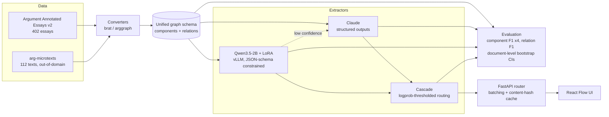

# Argument Mapper

**Can a fine-tuned 2B open model replace a frontier API for structured argument
extraction, and at what cost?**

Argument extraction is a structured-output task: given an argumentative text,
identify its claims and premises as spans, and the support/attack relations
between them. Frontier APIs do it well. This repository measures what it costs
to stop paying for them — F1, dollars, and latency, with confidence intervals,
on a standard benchmark and an out-of-domain test set.

**The short answer:** in domain, a LoRA fine-tuned Qwen3.5-2B matches Claude
Sonnet 5 on component extraction within ±0.04 F1, at 229× less per document.
Out of domain its relation extraction collapses from 0.452 F1 to **0.078**,
while Sonnet 5 improves. A confidence-routed cascade, with a threshold fitted
on the in-domain data and never re-tuned, detects that shift on its own and
escalates 70.5% of the out-of-domain traffic.

Every number below is produced by a script in this repository and written under
`results/`.

---

## Status

| Milestone | State |
|---|---|
| 1. Data and metrics | ✅ complete |
| 2. Frontier baselines (Sonnet 5, Haiku 4.5) | ✅ complete |
| 3. LoRA fine-tune (Qwen3.5-2B) | ✅ complete |
| 4. Constrained decoding (vLLM JSON schema) | ✅ complete |
| 5. Cascade routing | ✅ complete |
| 6. Serving and load test | ✅ complete |
| 7. UI | ✅ complete |
| 8. DeBERTa-v3 baseline (stretch) | — not attempted |

---

## Architecture



---

## Results

### Datasets

Measured by `argmap-build-datasets`, written to
[`results/datasets/summary.json`](results/datasets/summary.json).

| | AAE v2 | arg-microtexts (en) |
|---|---|---|
| Documents | 402 (258 train / 64 val / 80 test) | 112 (all test) |
| Mean length | 1,974 chars | 423 chars |
| Components | 6,089 | 576 |
| — MajorClaim / Claim / Premise | 751 / 1,506 / 3,832 | not labelled |
| Relations | 3,832 | 464 |
| — supports / attacks | 3,613 / 219 | 290 / 174 |
| Stance (For / Against) | 1,228 / 278 | n/a |

Two properties of this data shape every result that follows:

- **`attacks` is 5.7% of AAE relations** (219 of 3,832), leaving roughly 44 in
  the test set. Per-type attack F1 therefore carries a very wide interval, and
  untyped micro-F1 is the headline number.
- **arg-microtexts has no component type labels.** Its ADUs carry `pro`/`opp`
  dialectical roles, not the MajorClaim/Claim/Premise typology, so typed
  component F1 is reported as N/A there rather than as a fabricated number.

### Alignment ceiling

A model that emits component *text* has not said where that text is. Aligning
it back to a span introduces error that is charged to the extractor, so it caps
achievable F1. Measured by aligning **gold** component text against **gold**
documents, where the right answer is known exactly — 144 AAE documents (val +
test), 2,232 components. Full output in
[`results/alignment/alignment_error.json`](results/alignment/alignment_error.json).

| Condition | Exact span | Exact span (refined) | ≥50% overlap |
|---|---|---|---|
| verbatim | 0.998 | 0.998 | 0.998 |
| whitespace collapsed | 0.998 | 0.998 | 0.998 |
| lowercased | 0.598 | **0.950** | 0.997 |
| reworded (interior tokens dropped) | 0.167 | **0.780** | 0.992 |

Nothing failed to align in any condition (failure rate 0.000 throughout).
arg-microtexts behaves the same or slightly better (reworded: 0.167 → 0.781,
≥50% overlap 1.000).

Three things follow, and they shape how every later result should be read:

1. **Under overlap matching, alignment is not a meaningful ceiling.** Even when
   the text is reworded so that substring search cannot find it, 99.2% of
   components still land within the ≥50% criterion. Overlap-based F1 measures
   extraction, not alignment.
2. **Exact-span F1 largely measures verbatim copying.** It falls from 0.998 to
   0.167 purely from perturbing the text, with no change in extraction quality
   whatsoever. A model that paraphrases correctly is punished as hard as one
   that is wrong. Exact-span numbers are reported for comparability, but
   overlap is the headline.
3. **The refinement pass is worth 4.7×** on paraphrased text (0.167 → 0.780).
   The v1 matcher slides its window in quarter-window steps, so it can only
   land on the true boundary by luck; the hill-climb fixes that.

Two conditions in the JSON — `trimmed` and `truncated_80pct` — are flagged
`exact_span_meaningful: false`. Removing tokens only from the ends leaves a
contiguous substring that `str.find` still locates, so they exercise substring
search rather than alignment, and their true span genuinely differs from the
gold span. They are kept as a degradation check, not read as error.

### Extraction quality

Few-shot (3 exemplars from train), structured outputs, prompt caching.
Intervals are 95% bootstrap over documents. Full reports in
[`results/baselines/`](results/baselines/).

Two things about the columns, because both are easy to misread:

- **Typed** components require the MajorClaim/Claim/Premise label to agree as
  well as the span. **Typed** relations additionally require `supports` vs
  `attacks` to agree, on endpoints that themselves matched typed.
- The headline relation column **ignores relation type** — it asks only whether
  the right two components were linked. It is the looser, friendlier number,
  and it is reported next to the stricter one rather than instead of it.

**Argument Annotated Essays, test split (80 documents)**

| Model | Components (untyped) | Components (typed) | Relations (ignoring type) | Relations (typed) |
|---|---|---|---|---|
| Claude Haiku 4.5 | 0.859 [0.830, 0.882] | 0.709 [0.673, 0.743] | 0.441 [0.390, 0.494] | 0.389 [0.336, 0.444] |
| Claude Sonnet 5 | 0.883 [0.868, 0.897] | **0.762** [0.733, 0.791] | **0.485** [0.428, 0.542] | **0.437** [0.376, 0.497] |
| Qwen3.5-2B + LoRA | **0.899** [0.879, 0.917] | 0.756 [0.730, 0.782] | 0.452 [0.395, 0.510] | 0.389 [0.333, 0.447] |

All four columns use ≥50% token overlap for spans. Exact-span figures are in
the result files; see [Exact-span F1 is a trap](#exact-span-f1-is-a-trap) for
why they are not the headline.

**arg-microtexts, out of domain (112 documents).** Typed metrics are N/A —
this corpus has no component type labels.

| Model | Components (untyped) | Relations (ignoring type) |
|---|---|---|
| Claude Haiku 4.5 | 0.843 [0.810, 0.874] | 0.514 [0.460, 0.567] |
| Claude Sonnet 5 | **0.945** [0.930, 0.960] | **0.676** [0.626, 0.725] |
| Qwen3.5-2B + LoRA | 0.657 [0.604, 0.709] | 0.078 [0.051, 0.109] |

**Is Sonnet actually better?** Paired bootstrap over the same documents, in
[`results/comparisons/`](results/comparisons/). Against Haiku on AAE test it
wins significantly on 7 of 8 measures — but the headline relation F1 gap is
`+0.044 [-0.001, +0.089]`, which **straddles zero**. Comparing the two
marginal intervals would have missed that; the paired test is what makes the
claim honest.

Three things worth noting:

- **Zero invalid outputs in 550 API calls.** Structured outputs
  (`output_config.format`) made the v1 JSON-repair path entirely unnecessary on
  the Claude route.
- **Only 2 components out of ~7,000 could not be aligned** back to a span, so
  the generate-then-align design costs almost nothing in practice.
- **Relation F1 is the weak half** of every system here, at 0.44–0.49 in
  domain. Components are close to solved; relations are not.

### Exact-span F1 is a trap

The alignment ceiling above is not academic. On arg-microtexts, whose spans are
reconstructed from EDUs, exact-span component F1 is **0.025** for Sonnet 5
while overlap F1 on the *same predictions* is **0.945**. The model is finding
the right components and being scored near zero for not reproducing byte
offsets. This is why overlap is the headline metric throughout.

### Cost and latency

API prices are per-document means from the spend ledger, **scoped to one model
on one split of one corpus**, written by `argmap.cli.cost_report` to
[`results/cost/summary.json`](results/cost/). The local price is the A10G
hourly rate divided by measured throughput from the load test below.

Scoping matters more than it sounds. An AAE essay averages 1,974 characters and
a microtext 423, so the same model costs roughly twice as much per AAE
document. Averaging a model's whole ledger — which this repository did until
the cost table was rebuilt — produces a price that is correct for neither
corpus and that drifts with how many of each happen to have been run. It put
Sonnet 5 at $15.81/1K, a blend of $19.51 and $10.70, and understated the
in-domain ratio by a quarter.

**In domain — Argument Annotated Essays, test split**

| | $/doc | $/1K docs | vs local | p50 latency |
|---|---|---|---|---|
| Qwen3.5-2B + LoRA (A10G) | $0.000085 | **$0.09** | — | **5.3 s** |
| Claude Haiku 4.5 | $0.004662 | $4.66 | 55× | 3.4 s |
| Claude Sonnet 5 | $0.019511 | $19.51 | **229×** | 10.9 s |

**Out of domain — arg-microtexts, test split.** Shorter documents, so both
routes cost less and the ratios shrink. The local figures are not a like-for-
like alternative here: at 0.078 relation F1 the cheap route is not usable on
this corpus at any price.

| | $/doc | $/1K docs | vs local | p50 latency |
|---|---|---|---|---|
| Qwen3.5-2B + LoRA (A10G) | $0.000085 | $0.09 | — | — |
| Claude Haiku 4.5 | $0.001825 | $1.83 | 21× | 1.5 s |
| Claude Sonnet 5 | $0.010704 | $10.70 | 126× | 7.2 s |

The local model is also roughly **half Sonnet's latency** at concurrency 1.

Three caveats on the ratios, all load-bearing:

- **They assume a busy GPU.** An A10G idling between requests bills the same
  per hour, so 229× is a batch-workload number and shrinks with utilisation.
- **They are in-domain quality claims.** Out of domain the only route to usable
  quality is escalating 70.5% of traffic, which costs $7.61 per 1,000 rather
  than $0.09. The cost advantage and the quality claim have the same scope.
- **The local price uses served throughput; the cascade tables use batched
  offline throughput** on the corpus in question, which is the right basis for
  scoring a split in one job. Both are measured and each names its own; they
  differ by about 15%.

### Can a fine-tuned 2B replace the API?

**In domain, for components, yes. For relations the evidence is inconclusive.
Out of domain, no — and that is the sharpest result here.**

A paired bootstrap over the same 80 AAE test documents, all four matching
criteria, components and relations. Full output in
[`results/comparisons/`](results/comparisons/).

| Qwen3.5-2B + LoRA vs Sonnet 5 | Delta | 95% CI |
|---|---|---|
| Components, overlap untyped | +0.016 | [−0.003, +0.033] |
| Components, overlap typed | −0.006 | [−0.036, +0.025] |
| Relations, overlap ignoring type | −0.034 | [−0.097, +0.029] |
| Relations, overlap typed | −0.048 | [−0.113, +0.019] |

None of the eight measures (four criteria × components and relations) excludes
zero. But "not significant" is not "the same", and the two halves of the table
support very different claims:

- **Components: a real equivalence.** Both paired intervals sit inside
  ±0.04. Whatever the true difference is, it is small, and the data rules out
  a meaningful component-extraction gap on this corpus.
- **Relations: inconclusive.** The intervals are wide enough to contain a gap
  of roughly **0.1 F1** in Sonnet's favour — a gap that would matter. Eighty
  documents cannot resolve it. The honest statement is that this experiment
  did not detect a relation difference, not that there is none.

Against Haiku 4.5 the local model wins component extraction significantly on
all four criteria (+0.040 [+0.013, +0.072] untyped overlap) and ties on
relations.

Three seeds were trained; all three were merged and scored. The recipe is
stable, and the reported seed is an ordinary draw from it rather than a lucky
one ([`results/training/seed_variance_aae-v2_test.json`](results/training/)):

| AAE test, overlap | Seed 0 (reported) | Mean ± std over 3 seeds |
|---|---|---|
| Components, untyped | 0.899 | 0.904 ± 0.007 |
| Components, typed | 0.756 | 0.758 ± 0.014 |
| Relations, ignoring type | 0.452 | 0.452 ± 0.011 |
| Relations, typed | 0.389 | 0.384 ± 0.018 |

Seed 0 was selected on validation before seeds 1 and 2 were scored, so this is
a variance measurement rather than a second bite at the test set. It is also
the check that would have caught the bug below two days earlier: seed variance
of exactly 0.000 is not stability, it is three copies of the same model.

### Out of domain: the fine-tune does not transfer

The in-domain result is a claim about AAE essays, and arg-microtexts is what
happens when that assumption is dropped: 112 short German-sourced texts in
English translation, never seen in training, with no component type labels.

| arg-microtexts (112 docs), overlap untyped | Components | Relations |
|---|---|---|
| Claude Sonnet 5 | **0.945** | **0.676** |
| Claude Haiku 4.5 | 0.843 | 0.514 |
| Qwen3.5-2B + LoRA | 0.657 | **0.078** |
| Paired delta vs Sonnet 5 | −0.288 [−0.342, −0.238] | −0.597 [−0.651, −0.542] |
| Paired delta vs Haiku 4.5 | −0.186 [−0.241, −0.132] | −0.436 [−0.498, −0.372] |

Every one of those differences excludes zero by a wide margin. Component
extraction degrades; **relation extraction collapses**, from 0.452 in domain
to 0.078 out of it, while Sonnet 5 *gains* (0.485 → 0.676) on the easier,
shorter texts.

This is the honest shape of the headline. A 258-example fine-tune bought
in-domain parity with a frontier model at 229× less per document, and bought
nothing that survives a change of corpus. The frontier models are being paid
for generality, and this is the measurement that shows what generality is
worth. Anyone quoting the in-domain number without this one is quoting half a
result.

It also explains the in-domain number in a way worth stating: a model that
scores 0.078 on out-of-domain relations has not learned argument structure. It
has learned *this corpus's* argument structure — where the major claim sits,
how essay paragraphs are shaped, what an AAE premise looks like. That is a
legitimate and useful thing to buy for $20 of GPU time. It is not the same
thing the API is selling.

#### The in-domain result was wrong at first, and the way it was wrong matters

Before the fix, the same model measured 0.518 typed component F1 and 0.049
untyped relation F1 (the pre-fix report is kept verbatim at
[`results/diagnostics/qwen3.5-2b-lora_aae-v2_test_pre-merge-fix.json`](results/diagnostics/)),
and its relation output was a **star**: the first component supporting every
other one.

It was an artefact. vLLM accepted `--enable-lora`, accepted the `lora_request`
on every call, JIT-compiled the LoRA kernels, and served **base-model weights**.
No error, no warning. Five checks passed while the conclusion stayed false: the
adapter files were real and non-trivial, checkpoints from different epochs
differed on disk, the request was accepted, the kernels compiled, and 3 of 8
documents produced different output between adapters.

The decisive test was smaller than any of them — *ask the model to reproduce
its own training data*. Six documents the adapter saw ten times, generated
three ways
([`scripts/gpu/probe_adapter_effect.py`](scripts/gpu/probe_adapter_effect.py)):

| Path | Valid JSON |
|---|---|
| base model, transformers | **0 / 6** |
| base + adapter, PEFT | **6 / 6** |
| merged weights, transformers | **2 / 2** |

The adapter was fine. The serving path was not.

#### Root cause: a name mismatch nothing checks

Merging fixed it, but "we merged and it went away" is a workaround, not a
diagnosis. [`scripts/gpu/probe_lora_modules.py`](scripts/gpu/probe_lora_modules.py)
and [`probe_lora_rename.py`](scripts/gpu/probe_lora_rename.py) found the cause
([`results/diagnostics/`](results/diagnostics/)):

1. The adapter carries 192 LoRA tensors under **96 module names, every one
   prefixed `model.`** — `model.layers.0.mlp.down_proj` and so on. That is
   what PEFT saw, because training loaded the model with
   `AutoModelForCausalLM`.
2. vLLM 0.29 registers Qwen3.5 as `Qwen3_5ForConditionalGeneration`, a
   **subclass of the Qwen3-VL multimodal class**. Its weight mapper is
   `{"model.visual." → "visual.", "model.language_model." → "language_model.model.",
   "lm_head." → "language_model.lm_head."}`, so in vLLM the language model's
   modules live under **`language_model.model.`**.
3. vLLM's own name parser, run on the adapter's keys with that mapper, returns
   them **unchanged**: the mapper rewrites `model.language_model.`, and a bare
   `model.` prefix matches none of its rules. Ninety-six module names that the
   served model does not have.
4. A LoRA whose module name matches nothing is skipped. Not logged, not
   counted, not an error.

Step 4 is the whole bug: `--enable-lora` succeeded, the rank was accepted, the
kernels compiled, and the adapter was silently applied to nothing.

The proof is a prediction that could have failed. Rename the 192 tensors from
`base_model.model.model.*` to `base_model.model.language_model.model.*` and
change nothing else — same weights, same engine, same flags, same prompts:

| Served via vLLM `--enable-lora` | Valid JSON on 6 training documents |
|---|---|
| base model, no adapter | 0 / 6 |
| adapter, PEFT's original names | **0 / 6** — identical to no adapter |
| adapter, names rewritten for vLLM | **6 / 6** |

So there are two fixes: rename the adapter, or merge it. This project merges,
because a merged model has no adapter machinery to get this wrong and is what
a single-adapter deployment would ship anyway. The rename is the fix for anyone
who needs to serve several adapters from one engine.

The general lesson is in `probe_adapter_effect.py`, which now **exits non-zero
when an adapter does not change generation**. Five checks of the plumbing
passed; the test that mattered asked whether the thing had an effect, on data
where a working system could not fail, and cost one GPU minute.

One signal had been visible the whole time and was misread: checkpoint
selection scored three random seeds at **0.262997, standard deviation
0.000000** ([`results/training/checkpoint_selection.json`](results/training/)).
Three independent fine-tunes do not agree to six decimal places. Those numbers
predate the fix and are kept as the record of it.

### Constrained decoding

Same model, same prompts, same greedy decoding. The only difference is whether
vLLM was given the JSON schema. [`results/constrained/`](results/constrained/).

| AAE test (80 docs) | Invalid output | Truncated | Components (overlap untyped) |
|---|---|---|---|
| Constrained | **0.0%** (0/80) | 0.0% | 0.899 [0.879, 0.917] |
| Unconstrained | 1.2% (1/80) | 1.2% | 0.890 [0.869, 0.909] |

**In domain it buys a guarantee, not quality.** Seven of the eight paired
differences do not exclude zero; the eighth is +0.009 [+0.001, +0.019] on
untyped overlap components — real, and tiny. A model fine-tuned on this format
emits it unprompted 98.8% of the time.

**Out of domain it is a trade, and it trades quality away.** On arg-microtexts
the unconstrained run fails to parse on 7.1% of documents (8 of 112, every one
a truncation) — six times the in-domain rate. It also **scores higher**:

| arg-microtexts (112 docs), overlap untyped | Components | Relations |
|---|---|---|
| Constrained | 0.657 | 0.078 |
| Unconstrained | **0.705** | **0.095** |
| Paired delta | −0.048 [−0.085, −0.011] | −0.016 [−0.029, −0.004] |

Both exclude zero: constrained decoding is significantly *worse* here. The
mechanism is over-generation. The grammar can require a well-formed object but
cannot require a correct one, so on text the model does not recognise it keeps
emitting components until the schema's `maxItems` stops it — 384 false-positive
components against the unconstrained run's 238, dropping precision from 0.651
to 0.550 while recall rises only 0.769 → 0.816.

**But that comparison is unfair to the constrained run, and the correction is
the interesting part.** A run that fails to parse contributes no predictions at
all on that document: it costs recall and costs nothing in precision. Scoring
all 112 documents therefore credits the unconstrained run for the 8 it gave up
on. Restricted to the 104 both runs actually answered:

| arg-microtexts, 104 docs both answered | Components | Relations |
|---|---|---|
| Constrained | 0.716 | 0.092 |
| Unconstrained | 0.728 | 0.099 |
| Paired delta | −0.012 [−0.025, −0.001] | −0.007 [−0.018, +0.003] |

The component gap shrinks four-fold and stays significant; the relation gap
disappears into the noise. So roughly three-quarters of the headline quality
gap is not the grammar degrading answers — it is the grammar **forcing an
answer where the model would otherwise have failed loudly**, on its eight
hardest documents. 129 of the 384 false-positive components come from those
eight alone.

That is the trade, stated plainly:

- **Constrained**: every document gets a schema-valid answer. On the documents
  the model cannot handle, that answer is confidently wrong and indistinguishable
  from a good one downstream.
- **Unconstrained**: 7.1% of documents produce nothing, which is a *detectable*
  failure — a parse error is a signal a pipeline can route on, retry, or
  escalate. The price is that the caller must handle it.
- On like-for-like documents, the grammar costs about **0.012 F1** on
  components and nothing measurable on relations.

This project keeps the constraint, because the cascade above gives a better
answer to "what do we do with documents the model cannot handle" than a parse
error does: escalate on low confidence, before the output is generated rather
than after it fails. A pipeline without that escalation path should think
harder about this table than the in-domain one — a loud failure it can catch is
worth more than a quiet one it cannot.

The Claude route keeps Pydantic validation and has never needed it: 550 API
calls, zero invalid outputs.

**Syntax is not termination.** An earlier unbounded schema produced output that
was well-formed and still unusable: the model emitted the *type name* as each
component id, every relation referenced the same two generic ids, and an
unbounded array of such relations stays schema-valid forever. The grammar never
required a closing bracket, so generation ran to the token cap. The fix is to
make termination a property of the grammar — `maxItems` — and to check the
bound is reachable *within* the token budget, which a regression test now does.
This was observed while the serving path was silently running base weights, so
it describes an unadapted model. That is precisely the case constrained
decoding exists for, and the mechanism does not depend on the model.

### Cascade routing

Run the fine-tuned model on everything; escalate to Claude Sonnet 5 only where
the local model's mean token logprob falls below a threshold. The threshold is
**swept on AAE validation and then never touched again** — neither of the two
reported results re-tunes it. Full sweeps in
[`results/cascade/`](results/cascade/).

Cost per document is measured, not estimated, and **each split is priced
against its own documents**: the API price is the ledger mean over exactly the
documents in that split, and the local price is the A10G hourly rate divided by
batched throughput measured on that split. A sweep on AAE validation and a
report on arg-microtexts no more share a price than they share a corpus.

**Validation sweep**, AAE val, 64 documents, 22 operating points, scored under
`overlap>=0.5/typed` — the same criterion checkpoint selection used:

| Escalated | Components | Relations | $/1K docs |
|---|---|---|---|
| 0% (local only) | 0.738 | 0.379 | $0.09 |
| 4.7% (**selected**) | 0.749 | 0.400 | $1.02 |
| 60.9% (best observed) | 0.768 | 0.461 | $12.13 |
| 100% (Claude only) | 0.749 | 0.422 | $19.83 |

The selection rule is the **cheapest** point whose paired difference against
the best observed point does not exclude zero.

**In domain**, that threshold escalates **zero** of the 80 AAE test documents.
The local model is confident on all of them, and the cascade collapses to the
local route. Scored under `overlap>=0.5/typed`:

| | Delta vs Claude-only | 95% CI |
|---|---|---|
| Components | −0.006 | [−0.036, +0.025] |
| Relations | −0.048 | [−0.113, +0.019] |

Neither excludes zero, at **$0.10 per 1,000 documents against $19.61** —
**197× cheaper** for quality that is not measurably different. A cascade that
escalates nothing is not a cascade: in domain the finding is that *the routing
is unnecessary*, because the cheap leg is already good enough.

**Out of domain, the same threshold escalates 70.5%** of arg-microtexts —
79 of 112 documents — with no re-tuning of any kind. Scored under
`overlap>=0.5/untyped`, since that corpus has no component types:

| arg-microtexts (112 docs) | Components | Relations | $/1K docs |
|---|---|---|---|
| Local only (0% escalated) | 0.657 | 0.078 | $0.06 |
| **Cascade (70.5% escalated)** | **0.872** | **0.527** | **$7.61** |
| Claude Sonnet 5 only | 0.945 | 0.676 | $10.76 |

| Cascade vs | Components | Relations |
|---|---|---|
| local only | **+0.215** [+0.164, +0.269] | **+0.449** [+0.375, +0.521] |
| Claude only | −0.074 [−0.125, −0.038] | −0.149 [−0.210, −0.092] |

**This is the first real test of whether mean token logprob can route, and it
passes.** A threshold fitted on essays, carried unchanged to a different
corpus, escalated 0% of the documents the local model handles well and 70.5%
of the documents it does not. Nothing told it the domain had changed. It
recovered two-thirds of the component gap and three-quarters of the relation
gap for 29% less than paying the API for everything.

It does not close the gap: both deltas against Claude-only still exclude zero,
so the cascade is measurably worse than escalating everything, and the 33
documents it kept are ones it should partly have escalated. The claim the
result supports is that the confidence signal is **informative**, not that it
is sufficient.

**The selection logic had the same class of bug as the serving path.** It
originally hard-coded Claude-only as the quality ceiling and looked for the
cheapest point within noise of *that*. Once the local model matched the API,
that reference selected a point which was both more expensive and worse. The
assumption was invisible because it had been true when it was written;
referencing the best observed sweep point works either way.

### Throughput

Locust headless with zero wait time, driving **vLLM's own
`/v1/chat/completions` directly** — not the FastAPI router, so the router's
batching, content-hash cache and spend ledger are not in this path and neither
helps nor hurts these numbers. The client runs **inside the same container**
over localhost; on a laptop it would have measured a broadband link and the
round trip to Modal's region. A10G, merged weights, PyTorch-native sampler
(flashinfer's is disabled; see DECISIONS D21). Zero failures at every level.
[`results/serving/loadtest.json`](results/serving/).

| Concurrency | req/s | p50 | p95 | p99 | requests |
|---|---|---|---|---|---|
| 1 | 0.18 | 5.3 s | 7.3 s | 7.3 s | 13 |
| 2 | 0.36 | 5.2 s | 7.5 s | 8.1 s | 26 |
| 4 | 0.67 | 5.4 s | 7.9 s | 8.0 s | 49 |
| 8 | 1.24 | 5.9 s | 9.0 s | 12.0 s | 90 |
| 16 | 2.21 | 6.7 s | 9.6 s | 10.0 s | 161 |
| 32 | **3.59** | 8.1 s | 12.0 s | 12.0 s | 264 |

Throughput scales close to linearly to 32 concurrent — 20× the requests per
second for 32× the concurrency — while p50 rises only from 5.3 s to 8.1 s.

**3.59 req/s is the highest concurrency tested, not a saturation point.**
Throughput was still climbing at 32 and p50 was still under 9 s, so the GPU had
not been driven to its limit; the sweep stopped there, not the hardware. The
cost table above therefore divides the GPU hourly rate by 12,920 documents/hour
— a *measured lower bound* on what this stack can do, which makes the local
cost per document an over-estimate rather than a flattering one.

Only the local route is load-tested. Driving concurrent load at the Anthropic
API would spend real money to measure someone else's infrastructure; that
route's per-request latency is in the cost table.

### Running the stack

```bash
docker compose up                    # API + web, Claude route
docker compose --profile local up    # adds the fine-tuned model (needs a GPU)
```

The local profile is opt-in. Without a GPU the API still runs, `/health`
reports `local: false`, and the front end greys that route out rather than
offering something that cannot work.

---

## Interface


Source text on the left, argument graph on the right, both linked: selecting a
component highlights it in all three panels. The graph is laid out
bottom-to-top so premises sit beneath what they support and the major claim
rises to the top, which makes an inverted edge obvious at a glance.

Every run shows what it cost — model, latency and dollars — because the
question this repository asks is quality *per dollar*, and a graph with no
price attached hides half of it. Routes the server reports as unconfigured are
disabled rather than hidden, so an unavailable local model is visible instead
of silently missing.


The gold-annotation overlay draws annotator spans as an underline beneath the
prediction's background tint, rather than as a second background — two
backgrounds are illegible exactly where the layers disagree, which is the part
worth reading closely.

Screenshots are captured by `web/screenshots.mjs` against the production build.
They only ever use the synthetic sample passage: the AAE licence forbids
displaying the corpus, and a screenshot in a public README is about as
displayed as text gets.

---

## Reproducing

Requires Python 3.11+ and [uv](https://docs.astral.sh/uv/).

```bash
uv sync --extra dev
```

### Data

`arg-microtexts` downloads automatically. **Argument Annotated Essays v2 cannot
be downloaded headlessly** — TUdatalib: Fetch it once in
a browser:

1. Open <https://tudatalib.ulb.tu-darmstadt.de/handle/tudatalib/2422>
2. Clear the bot challenge and download `ArgumentAnnotatedEssays-2.0.zip`
3. Place it in `data/raw/`

It is verified by SHA-256 on load. Then:

```bash
uv run argmap-build-datasets            # -> data/processed/, splits/, results/datasets/
uv run python -m argmap.cli.eval_alignment
```

### Baselines, fine-tune, and everything else

The API baselines need `ANTHROPIC_API_KEY` (see `.env.example`); the spend cap
defaults to $20 and the ledger replays from disk on startup, so re-running a
script cannot silently reset the budget.

```bash
uv run python -m argmap.cli.run_baseline --model claude-sonnet-5 --split test
uv run python -m argmap.cli.compare --a qwen3.5-2b-lora --b claude-sonnet-5
```

The GPU work runs on [Modal](https://modal.com) (`modal token new` first).
Note the merge step: **serve merged weights, not base + adapter** — see the
diagnostic above for why.

```bash
uv run modal run scripts/gpu/train_lora.py --seeds 0,1,2 --epochs 10
uv run modal run scripts/gpu/train_lora.py::merge     --adapter Qwen__Qwen3.5-2B/e10/seed0/epoch10 --out-name e10-seed0-epoch10
uv run modal run scripts/gpu/gen_val.py  --merged e10-seed0-epoch10
uv run modal run scripts/gpu/gen_test.py --merged e10-seed0-epoch10
uv run modal run scripts/gpu/loadtest.py --merged e10-seed0-epoch10
uv run python -m argmap.cli.cascade --sweep-split val --report-split test
```

### Checks

```bash
uv run ruff check . && uv run ruff format --check .
uv run pyright
uv run pytest
```

CI runs all three on CPU against synthetic fixtures, so it never needs the
licensed corpora.

---

## Licensing and data handling

**The corpora are not in this repository and must not be added to it.**

Argument Annotated Essays v2 is distributed under a TU Darmstadt / UKP
agreement restricting it to academic use, whose clause 2.2 forbids publishing,
redistributing, or displaying the data in any form. This repository is public,
so:

- `data/` is gitignored, and a CI job fails the build if corpus files are ever
  tracked
- few-shot exemplars are generated into a gitignored file at runtime rather
  than hardcoded into committed source
- fine-tuned weights are not published, being plausibly derivative
- screenshots use a synthetic passage, never corpus text

If you use the corpora, cite them:

- Christian Stab and Iryna Gurevych. 2016. *Parsing Argumentation Structure in
  Persuasive Essays.* <https://arxiv.org/abs/1604.07370>
- Andreas Peldszus and Manfred Stede. 2015. *An annotated corpus of
  argumentative microtexts.* First European Conference on Argumentation.
  (CC BY-NC-SA 4.0)

The code in this repository is MIT licensed.

---

## Layout

```
src/argmap/
  schema.py        unified graph schema; validates span/text integrity
  align.py         fuzzy text -> span alignment, and its refinement pass
  prompts.py       response schema, system prompt, bounded grammar
  data/            corpus converters (brat, arggraph), download, splits
  metrics/         matching criteria, P/R/F1, document-level bootstrap
  extractors/      Claude and vLLM routes + the shared graph assembler
  serve/           FastAPI router, batching, content-hash cache, spend ledger
  cli/             dataset build, alignment study, baselines, cascade,
                   compare, seed variance
scripts/gpu/       Modal jobs: train, merge, generate, load test, probes
                   (probe_adapter_effect.py fails if an adapter does nothing)
docker/            API and web images; compose.yaml wires them together
tests/             pytest; synthetic fixtures only, no corpus needed
web/               React Flow + dagre front end
results/           every measured number
splits/            essay ID lists (no text) so splits are reproducible
```
