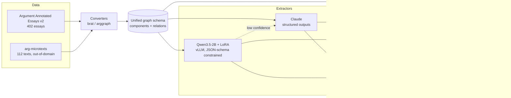

# Argument Mapper

**Can a fine-tuned 2B open model replace a frontier API for structured argument
extraction, and at what cost?**

Argument extraction is a structured-output task: given an argumentative text,
identify its claims and premises as spans, and the support/attack relations
between them. Frontier APIs do it well. This repository measures what it costs
to stop paying for them — F1, dollars, and latency, with confidence intervals,
on a standard benchmark and an out-of-domain test set.

Every number below is produced by a script in this repository and written under
`results/`. Anything not yet measured says `TBD` rather than an estimate.

---

## Status

| Milestone | State |
|---|---|
| 1. Data and metrics | ✅ complete |
| 2. Frontier baselines (Sonnet 5, Haiku 4.5) | ✅ complete |
| 3. LoRA fine-tune (Qwen3.5-2B) | ⬜ |
| 4. Constrained decoding (vLLM JSON schema) | ⬜ |
| 5. Cascade routing | ⬜ |
| 6. Serving and load test | ⬜ |
| 7. UI | ⬜ |
| 8. DeBERTa-v3 baseline (stretch) | ⬜ |

---

## Architecture



---

## Results

### Datasets

Measured by `argmap-build-datasets`, written to
[`results/datasets/summary.json`](results/datasets/summary.json).

| | AAE v2 | arg-microtexts (en) |
|---|---|---|
| Documents | 402 (258 train / 64 val / 80 test) | 112 (all test) |
| Mean length | 1,974 chars | 423 chars |
| Components | 6,089 | 576 |
| — MajorClaim / Claim / Premise | 751 / 1,506 / 3,832 | not labelled |
| Relations | 3,832 | 464 |
| — supports / attacks | 3,613 / 219 | 290 / 174 |
| Stance (For / Against) | 1,228 / 278 | n/a |

Two properties of this data shape every result that follows:

- **`attacks` is 5.7% of AAE relations** (219 of 3,832), leaving roughly 44 in
  the test set. Per-type attack F1 therefore carries a very wide interval, and
  untyped micro-F1 is the headline number.
- **arg-microtexts has no component type labels.** Its ADUs carry `pro`/`opp`
  dialectical roles, not the MajorClaim/Claim/Premise typology, so typed
  component F1 is reported as N/A there rather than as a fabricated number.

### Alignment ceiling

A model that emits component *text* has not said where that text is. Aligning
it back to a span introduces error that is charged to the extractor, so it caps
achievable F1. Measured by aligning **gold** component text against **gold**
documents, where the right answer is known exactly — 144 AAE documents (val +
test), 2,232 components. Full output in
[`results/alignment/alignment_error.json`](results/alignment/alignment_error.json).

| Condition | Exact span | Exact span (refined) | ≥50% overlap |
|---|---|---|---|
| verbatim | 0.998 | 0.998 | 0.998 |
| whitespace collapsed | 0.998 | 0.998 | 0.998 |
| lowercased | 0.598 | **0.950** | 0.997 |
| reworded (interior tokens dropped) | 0.167 | **0.780** | 0.992 |

Nothing failed to align in any condition (failure rate 0.000 throughout).
arg-microtexts behaves the same or slightly better (reworded: 0.167 → 0.781,
≥50% overlap 1.000).

Three things follow, and they shape how every later result should be read:

1. **Under overlap matching, alignment is not a meaningful ceiling.** Even when
   the text is reworded so that substring search cannot find it, 99.2% of
   components still land within the ≥50% criterion. Overlap-based F1 measures
   extraction, not alignment.
2. **Exact-span F1 largely measures verbatim copying.** It falls from 0.998 to
   0.167 purely from perturbing the text, with no change in extraction quality
   whatsoever. A model that paraphrases correctly is punished as hard as one
   that is wrong. Exact-span numbers are reported for comparability, but
   overlap is the headline.
3. **The refinement pass is worth 4.7×** on paraphrased text (0.167 → 0.780).
   The v1 matcher slides its window in quarter-window steps, so it can only
   land on the true boundary by luck; the hill-climb fixes that.

Two conditions in the JSON — `trimmed` and `truncated_80pct` — are flagged
`exact_span_meaningful: false`. Removing tokens only from the ends leaves a
contiguous substring that `str.find` still locates, so they exercise substring
search rather than alignment, and their true span genuinely differs from the
gold span. They are kept as a degradation check, not read as error.

### Extraction quality

Few-shot (3 exemplars from train), structured outputs, prompt caching.
Intervals are 95% bootstrap over documents. Full reports in
[`results/baselines/`](results/baselines/).

**Argument Annotated Essays, test split (80 documents)**

| Model | Component F1 (overlap, untyped) | Component F1 (overlap, typed) | Relation F1 (overlap) |
|---|---|---|---|
| Claude Haiku 4.5 | 0.859 [0.830, 0.882] | 0.709 [0.673, 0.743] | 0.441 [0.390, 0.494] |
| Claude Sonnet 5 | **0.883** [0.868, 0.897] | **0.762** [0.733, 0.791] | **0.485** [0.428, 0.542] |

**arg-microtexts, out-of-domain (112 documents).** Typed metrics are N/A —
this corpus has no component type labels.

| Model | Component F1 (overlap, untyped) | Relation F1 (overlap) |
|---|---|---|
| Claude Haiku 4.5 | 0.843 [0.810, 0.874] | 0.514 [0.460, 0.567] |
| Claude Sonnet 5 | **0.945** [0.930, 0.960] | **0.676** [0.626, 0.725] |

**Is Sonnet actually better?** Paired bootstrap over the same documents, in
[`results/comparisons/`](results/comparisons/). On AAE test it wins
significantly on 7 of 8 measures — but the headline relation F1 gap is
`+0.044 [-0.001, +0.089]`, which **straddles zero**. Comparing the two
marginal intervals would have missed that; the paired test is what makes the
claim honest.

Three things worth noting:

- **Zero invalid outputs in 548 API calls.** Structured outputs
  (`output_config.format`) made the v1 JSON-repair path entirely unnecessary on
  the Claude route.
- **Only 2 components out of ~7,000 could not be aligned** back to a span, so
  the generate-then-align design costs almost nothing in practice.
- **Relation F1 is the weak half** of both models, at 0.44–0.49 in domain.
  Components are close to solved; relations are not.

### Exact-span F1 is a trap

The alignment ceiling above is not academic. On arg-microtexts, whose spans are
reconstructed from EDUs, exact-span component F1 is **0.025** for Sonnet 5
while overlap F1 on the *same predictions* is **0.945**. The model is finding
the right components and being scored near zero for not reproducing byte
offsets. This is why overlap is the headline metric throughout.

### Cost and latency

Measured per document from the cost ledger
([`results/cost/ledger.jsonl`](results/cost/)), synchronous calls, prompt
caching on. Latency is wall-clock from an ordinary consumer connection.

| Model | $/doc (AAE) | $/1K docs | p50 | p95 |
|---|---|---|---|---|
| Claude Haiku 4.5 | $0.0047 | $4.66 | 3.42 s | 4.68 s |
| Claude Sonnet 5 | $0.0195 | $19.51 | 10.93 s | 24.19 s |

Sonnet 5 costs **4.2×** more and is **3.2×** slower for +0.053 typed component
F1 and +0.044 relation F1. That gap is the whole reason to ask whether a
fine-tuned 2B model can close it.

Prompt caching matters more than it looks: the 3-exemplar prefix is ~4,970
tokens carried on every request, and caching bills it at a tenth. It also has
a trap — see the note on Haiku's 4,096-token minimum in *Reproducing* below.

### Cascade operating points

`TBD` — milestone 5.

### Throughput

`TBD` — milestone 6.

---

## Reproducing

Requires Python 3.11+ and [uv](https://docs.astral.sh/uv/).

```bash
uv sync --extra dev
```

### Data

`arg-microtexts` downloads automatically. **Argument Annotated Essays v2 cannot
be downloaded headlessly** — TUdatalib sits behind a proof-of-work bot
challenge that returns an HTML page to any non-browser client. Fetch it once in
a browser:

1. Open <https://tudatalib.ulb.tu-darmstadt.de/handle/tudatalib/2422>
2. Clear the bot challenge and download `ArgumentAnnotatedEssays-2.0.zip`
3. Place it in `data/raw/`

It is verified by SHA-256 on load. Then:

```bash
uv run argmap-build-datasets            # -> data/processed/, splits/, results/datasets/
uv run python -m argmap.cli.eval_alignment
```

### Checks

```bash
uv run ruff check . && uv run ruff format --check .
uv run pyright
uv run pytest
```

CI runs all three on CPU against synthetic fixtures, so it never needs the
licensed corpora.

---

## Licensing and data handling

**The corpora are not in this repository and must not be added to it.**

Argument Annotated Essays v2 is distributed under a TU Darmstadt / UKP
agreement restricting it to academic use, whose clause 2.2 forbids publishing,
redistributing, or displaying the data in any form. This repository is public,
so:

- `data/` is gitignored, and a CI job fails the build if corpus files are ever
  tracked
- few-shot exemplars are generated into a gitignored file at runtime rather
  than hardcoded into committed source
- fine-tuned weights are not published, being plausibly derivative
- screenshots use a synthetic passage, never corpus text

If you use the corpora, cite them:

- Christian Stab and Iryna Gurevych. 2016. *Parsing Argumentation Structure in
  Persuasive Essays.* <https://arxiv.org/abs/1604.07370>
- Andreas Peldszus and Manfred Stede. 2015. *An annotated corpus of
  argumentative microtexts.* First European Conference on Argumentation.
  (CC BY-NC-SA 4.0)

The code in this repository is MIT licensed.

---

## Layout

```
src/argmap/
  schema.py        unified graph schema; validates span/text integrity
  align.py         fuzzy text -> span alignment, and its refinement pass
  data/            corpus converters (brat, arggraph), download, splits
  metrics/         matching criteria, P/R/F1, document-level bootstrap
  cli/             dataset build, alignment study
tests/             pytest; synthetic fixtures only, no corpus needed
web/               React Flow + dagre front end
results/           every measured number
splits/            essay ID lists (no text) so splits are reproducible
```
